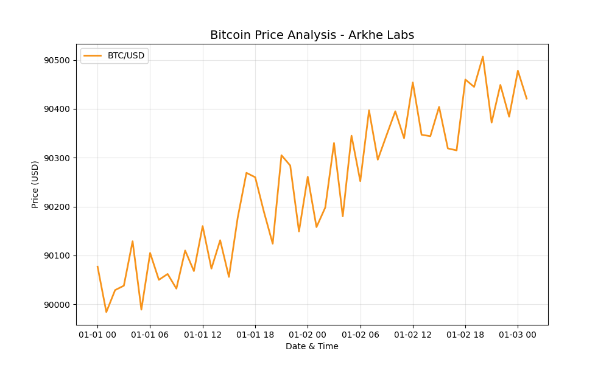
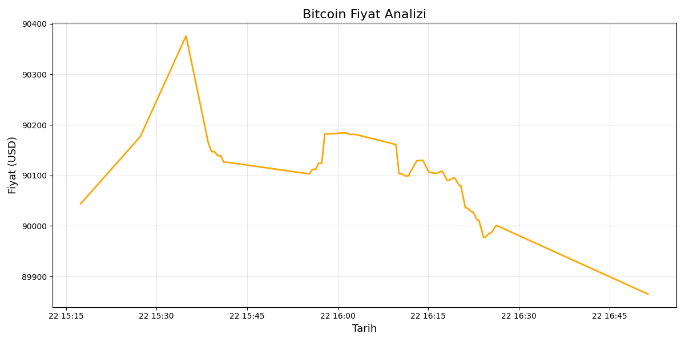

# 🛡️ Crypto Sentinel Bot (Arkhe Labs)

An automated, cloud-native Python bot that tracks Bitcoin prices in real-time and sends professional visual alerts via Telegram when critical targets are hit.

<p align="center">
  
  
</p>

## 🚀 Key Features
- **Real-Time Monitoring:** Fetches live market data 24/7.
- **Smart Visuals:** Generates professional trend charts using `Matplotlib` & `Pandas`.
- **Instant Alerts:** Sends a chart + detailed report to your phone via Telegram API.
- **Secure Architecture:** Uses environment variables (`.env`) for zero-risk credential management.
- **Cloud Ready:** Optimized to run on cloud platforms like PythonAnywhere.

## 🛠️ Tech Stack
* **Core:** Python 3.x
* **Data Analysis:** Pandas, NumPy
* **Visualization:** Matplotlib
* **Network:** Requests API
* **Security:** Python-Dotenv

## 📦 How to Run
1. Clone the repository:
   ```bash
   git clone [https://github.com/sefOzkn/crypto-sentinel-bot.git](https://github.com/sefOzkn/crypto-sentinel-bot.git)

2. Install dependencies:
pip install -r requirements.txt

3. Create a .env file and add your Telegram tokens:
TELEGRAM_TOKEN="your_token_here"
CHAT_ID="your_chat_id"

4. Run the sentinel:
python crypto.py

Developed by Sef | Powered by Arkhe Labs